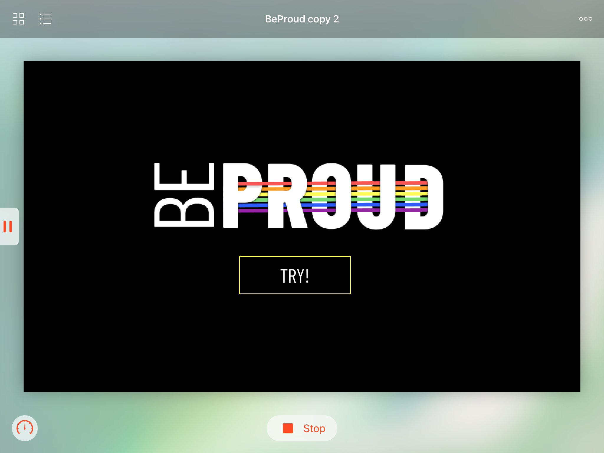
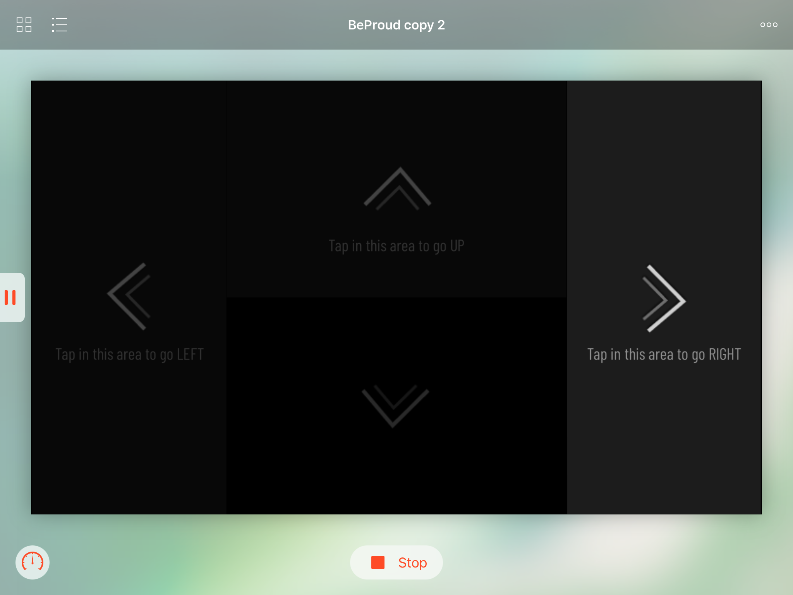
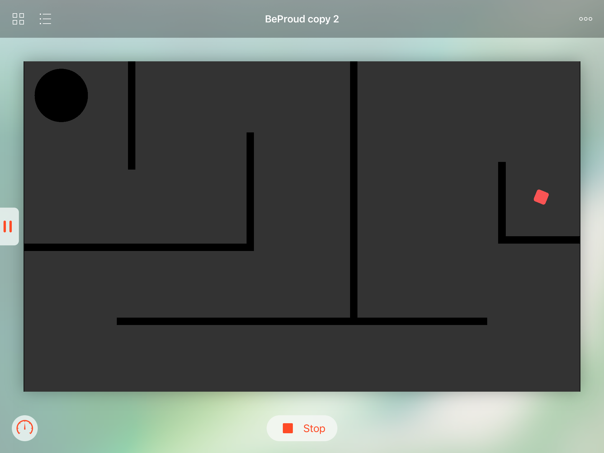
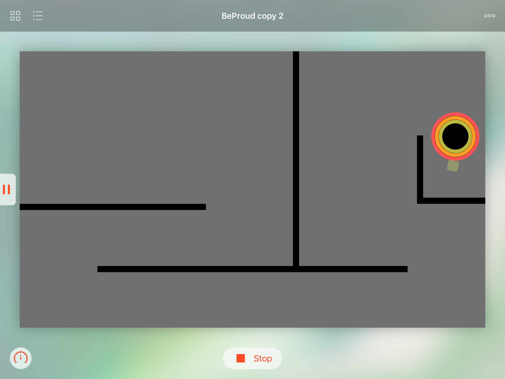
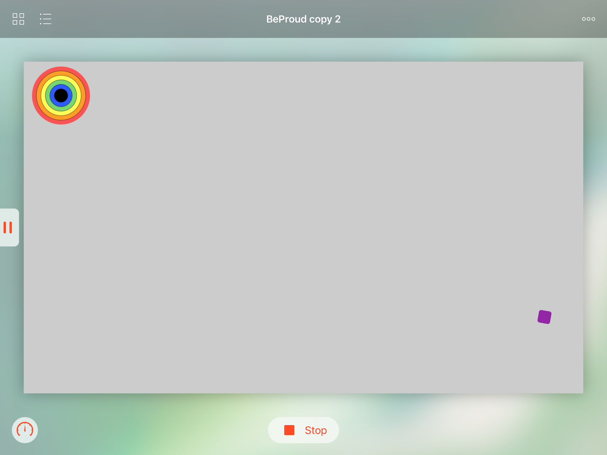
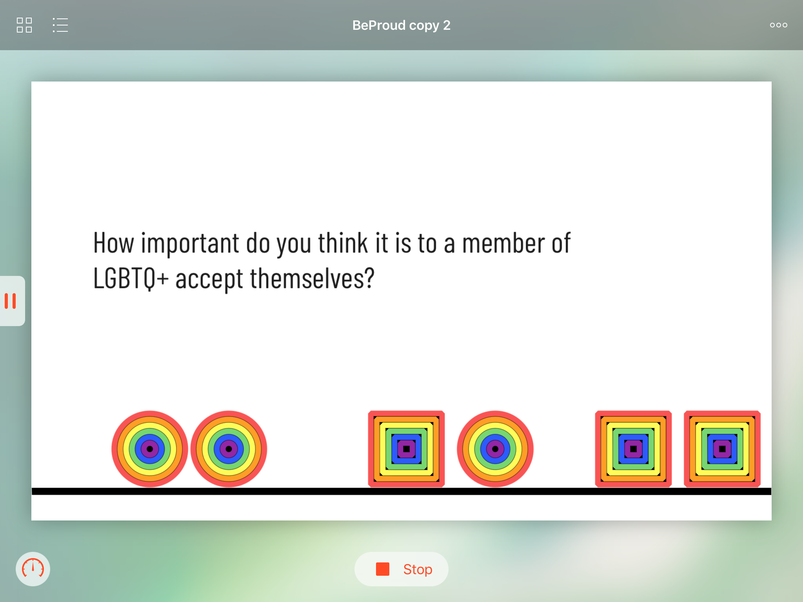
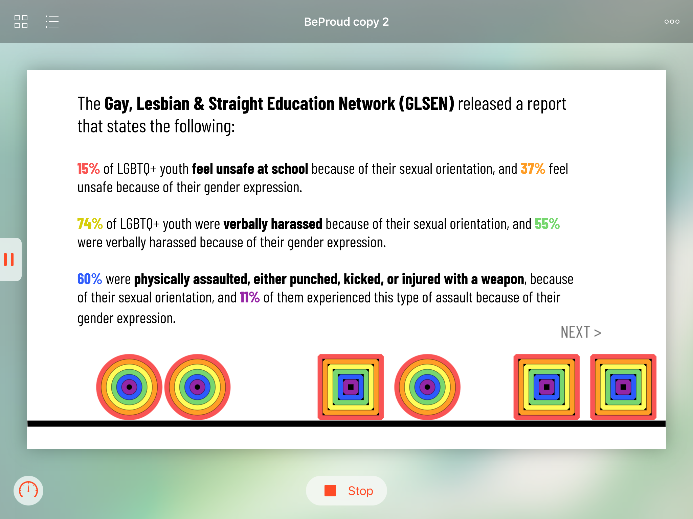
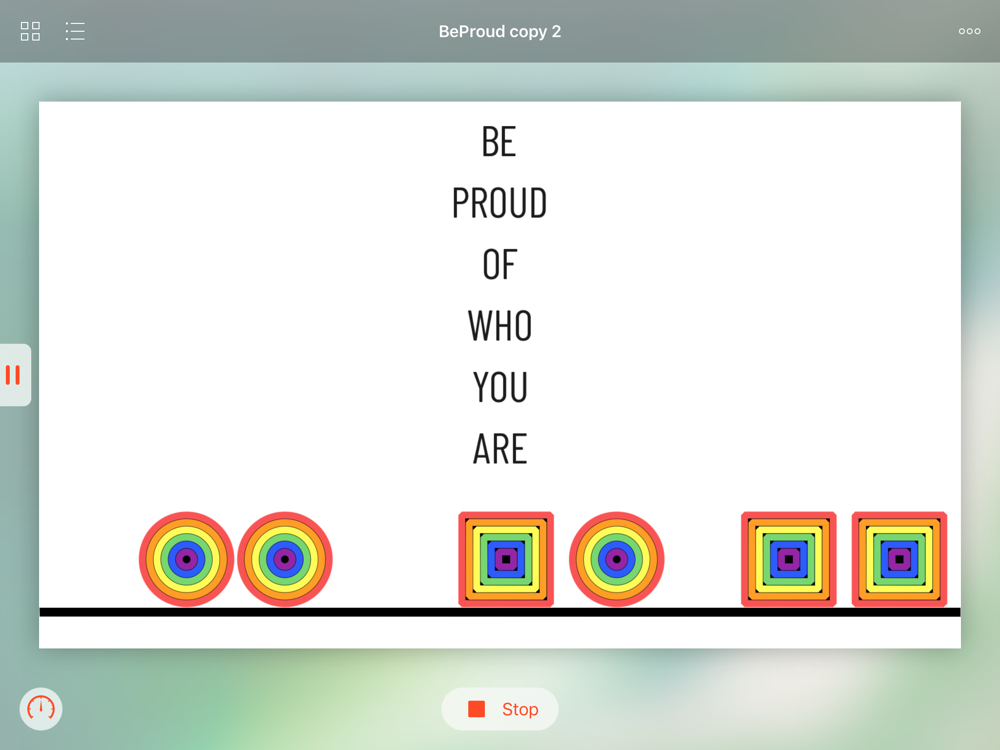

# BeProud
## WWDC 2018 Playground
The purpose of this playground is to metaphorically bring about the self-acceptance of a person from the LGBTQIA+ community. The circle, in this context, represents a person and at each stage, it becomes happier (colored) and has fewer obstacles to overcome.

### Be proud of who you are!

